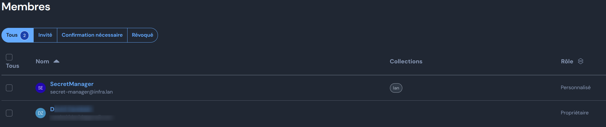

This installation step occurs after the K3s full setting on OMV (or other). Some parts of the installation process are automated (see `roles/openmediavault` for details), others are manual

## Prerequisits

### Client side
* [kubectl]()
* [helm 3]()

### Cluster side

A working **traefik** Ingress controler with its associated CRDs and a default **storage class**

## First deployment

### Import cluster root CA

From the node, **as root**, run

```shell
kubectl apply -f /etc/ssl/private/ca-omv-cluster.yml
```

> To renew the cluster CA, you will need to run `roles/openmediavault` to generate the yml and re-execute the command 

### Deploy the vault

1. Create the namespace

```shell
kubectl apply -f ./overlays/prod/vaultwarden/ns-vaultwarden.yml
```

2. Create manually the following **secret** 
We will assume that:

`BW_USERNAME`: **secret-manager@infra.lan**
`SVC_USER`: **secret-manager**

```yaml
cat <<EOF | kubectl apply -f -
apiVersion: v1
data:
  BW_HOST: aHR0cDovLzEyNy4wLjAuMTo4MA==
  SVC_USER: c2VjcmV0LW1hbmFnZXI=
  SVC_PASSWORD: <some_password_in_base64>
  BW_USERNAME: c2VjcmV0LW1hbmFnZXJAaW5mcmEubGFu
  BW_PASSWORD: <some_password_in_base64>
kind: Secret
metadata:
  name: bitwarden-cli
  namespace: vaultwarden
type: Opaque
EOF
```
3. Install the app

```shell
kubectl apply -k ./overlays/prod/vaultwarden
```

#### Case 1: Reuse PVC from previous install

Simply `cp -r` from archive to vaultwarden PVC (**vaultwarden-data**)

#### Case 2: Set vault from scratch

All infra secrets are pulled by a vaultwarden service account identified by **secret-manager@infra.lan** from a specific collection named `lan`. The **service account** and **the collection** cannot be provisioned and must be created manually. Use the same password as the one you choose for `BW_PASSWORD` at step one




### Set the External Secret Manager up

1. Create the namespace

```shell
kubectl apply -f ./overlays/prod/external-secret-operator/ns-external-secrets.yml
```

2. Create the secret to access bitwarden-cli

```shell
# extract creds from the secret previously created
VAULT_PASS=$(kubectl get secret -n vaultwarden bitwarden-cli -o json | jq -r '.data.SVC_PASSWORD')
VAULT_USER=$(kubectl get secret -n vaultwarden bitwarden-cli -o json | jq -r '.data.SVC_USER')

# create the secret to be used by the ClusterSecretStore
cat <<EOF | kubectl apply -f -
apiVersion: v1
data:
  SVC_USER: $VAULT_USER
  SVC_PASSWORD: $VAULT_PASS
kind: Secret
metadata:
  name: bitwarden-cli-credentials
  namespace: external-secrets
  labels:
    external-secrets.io/type: webhook
type: Opaque
EOF
```

3. Deploy the **external-secret-operator**

```shell
kubectl apply -k ./overlays/prod/external-secret-operator
```

### Create the various .env

Generate the different `.env` files from the followings `.env.example`

```shell
find ./ -name "*.env.example"
```

### Deploy

**Inspect**

```shell
kubectl kustomize ./overlays/<env>
```

**apply changes to cluster**

```shell
kubectl apply -k ./overlays/<env>
```

## Disaster recovery

### saved  PVC 

Persistent volume claims handled by the `storageClass` **saved-local-path**. `k3s-archive-saved-pvc` (provisioned by ansible) should be used in a CRON job to save those PVC on a different volume. 

Encrypted archives can be decrypted + extracted using

```shell
openssl enc -pbkdf2 -d -aes256 -in name_of_the.tar.gz.aes  | tar -xz
```
to provide password from STDIN or with 

```shell
openssl enc -pbkdf2 -d -pass file:/path/to/.archive_password -aes256 -in name_of_the.tar.gz.aes  | tar -xz
```

