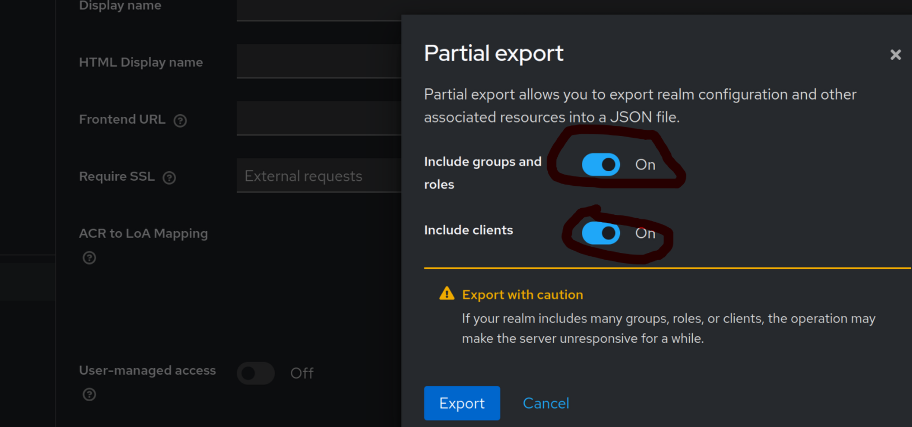

## Provisioning

Add simply the json definitions in `./keycloak/provisioning` and update `./keycloak/kustomization.yml` 

Resources covered by **keycloak-provisioner** sidecar:
* realms
* clients

Because of keycloak uuid instability (`uuid` not exported in resource def, generated on creation), **keycloak-provisioner** identifies existing resources based on the following fields

| resource_type | field      |     json naming convention      |
| ------------: | :--------- | :-----------------------------: |
|        realms | `id`       | realm-<wathever-you-want>.json  |
|       clients | `clientId` | client-<wathever-you-want>.json |

> If some applications **Roles** depend on **Realm Groups**, please export realm will all parameters (see bellow) for provisioning to succeed

### Limitations

* One realm: all resources are created in the same realm

## Roadmap

- [X] watchdog for `keycloak.provisioning`
- [ ] metrics exportation
